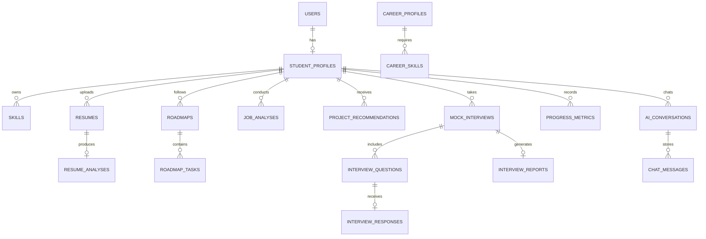

# SkillBridge AI — Database Architecture & Schema Reference

SkillBridge AI uses an asynchronous relational database architecture powered by **SQLAlchemy 2.0** and **aiosqlite / SQLite** (stored at `backend/skillbridge.db`).

---

## Entity Relationship Overview

---

## Tables & Schema Definitions

### 1. `users`
Core authentication and user credentials.
- `id` (Integer, Primary Key)
- `email` (String, Unique, Indexed)
- `hashed_password` (String)
- `full_name` (String)
- `role` (String, default: "student")
- `is_active` (Boolean, default: True)
- `created_at`, `updated_at` (DateTime)

### 2. `student_profiles`
Academic background and current career target.
- `id` (Integer, Primary Key)
- `user_id` (Integer, Foreign Key `users.id`)
- `college`, `degree`, `branch` (String)
- `semester` (Integer), `graduation_year` (Integer)
- `cgpa` (Float)
- `target_career` (String)
- `onboarding_completed` (Boolean)
- `career_readiness_score` (Integer)

### 3. `skills`
Validated student skills and proficiency tiers.
- `id` (Integer, Primary Key)
- `profile_id` (Integer, Foreign Key `student_profiles.id`)
- `name` (String)
- `category` (String: "Languages", "AI / ML", "Frontend", "Backend", etc.)
- `proficiency_level` (String: "Beginner", "Intermediate", "Advanced")
- `is_verified` (Boolean)

### 4. `career_profiles`
Curated industry roles and salary benchmarks.
- `id` (Integer, Primary Key)
- `title` (String, Unique)
- `description` (Text)
- `domain` (String)
- `demand_level` (String: "Very High", "High", "Medium")
- `average_salary_range` (String)
- `market_growth_rate` (String)

### 5. `career_skills`
Prerequisite skills mapped to career profiles.
- `id` (Integer, Primary Key)
- `career_id` (Integer, Foreign Key `career_profiles.id`)
- `skill_name` (String)
- `importance_level` (String: "High", "Medium", "Low")
- `minimum_proficiency` (String)

### 6. `resumes` & `resume_analyses`
Uploaded student resumes and ATS scoring diagnostics.
- `overall_score`, `ats_score`, `skills_score`, `project_score`, `experience_score`, `formatting_score` (Integer)
- `strengths`, `weaknesses`, `missing_keywords` (JSON Array)
- `improved_bullets` (JSON Array of Google XYZ Before & After rewrites)
- `actionable_recommendations` (JSON Array)

### 7. `roadmaps` & `roadmap_tasks`
Structured milestone curriculum.
- `roadmaps`: `title`, `career_title`, `target_duration_months`, `completion_percentage`, `overview_summary`
- `roadmap_tasks`: `phase_number`, `phase_name`, `task_title`, `description`, `skills_covered` (JSON), `learning_resources` (JSON), `project_checkpoint` (Text), `estimated_hours` (Integer), `is_completed` (Boolean)

### 8. `mock_interviews`, `interview_questions`, `interview_reports`
Live simulation sessions and scorecards.
- `mock_interviews`: `career_title`, `interview_type`, `difficulty`, `status`, `total_questions`, `overall_score`
- `interview_questions`: `question_text`, `question_type`, `expected_topics` (JSON), `rubric` (JSON)
- `interview_responses`: `user_answer`, `technical_accuracy`, `completeness`, `clarity`, `score`, `feedback`
- `interview_reports`: `overall_score`, `technical_score`, `communication_score`, `strengths`, `weaknesses`, `recommended_topics`

### 9. `progress_metrics`
Longitudinal monthly tracking records.
- `month_label` (String, e.g. "Month 1")
- `career_readiness_score`, `skill_completion_percentage`, `resume_score`, `interview_readiness_score` (Integer)
- `hours_spent`, `projects_completed` (Integer)

---

## Seed Data Summary
The database includes pre-seeded production data:
- Demo student **Rahul Sharma** (`demo@skillbridge.ai`) with Semester 6 Computer Science profile, 8 validated technical skills, active AI/ML Engineer roadmap, resume analysis, and interview session.
- 7 Industry Career Profiles: **AI/ML Engineer**, **Data Scientist**, **Full Stack Developer**, **Cloud DevOps Engineer**, **Cybersecurity Analyst**, **Backend Systems Engineer**, **Mobile App Developer**.
- 50+ benchmarked technical skills with importance tiers.
